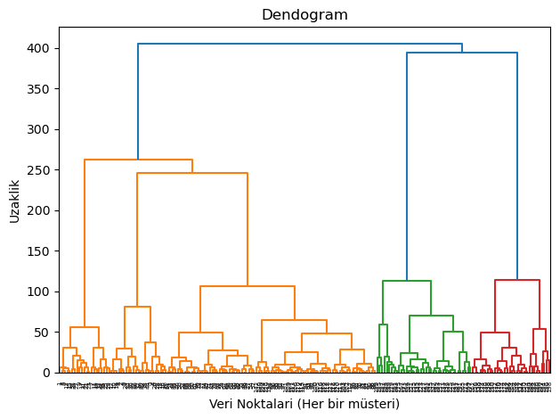
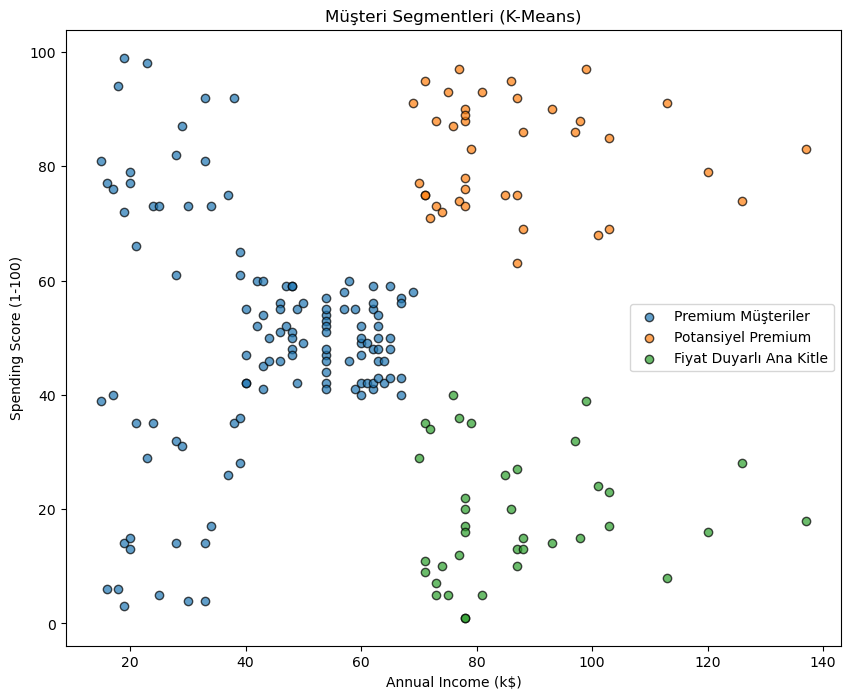
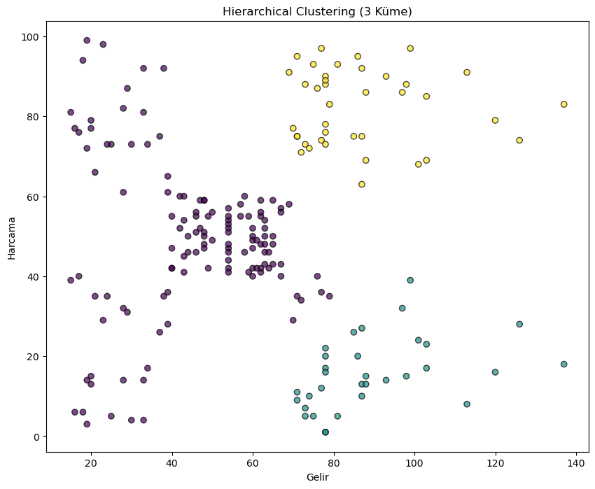

# Mall Customer Segmentation

This project performs **customer segmentation analysis** using **K-Means** and **Hierarchical Clustering** on the Kaggle *Mall Customers* dataset.

The goal is to identify meaningful customer groups based on **Annual Income** and **Spending Score**, and interpret these groups from a business perspective.

---

## 📂 Project Structure
├── Mall_Customers.csv
├── mall_customers.ipynb
├── k_means.png
├── dendogram.png
├── hierarchical_clustering.png
└── README.md

---

## 📊 Dataset
- **Source:** Kaggle – Mall Customer Segmentation Data  
- **Features used for clustering:**
  - Annual Income (k$)
  - Spending Score (1–100)
- **Additional feature:**
  - Gender (used only for post-clustering analysis)

---

## ⚙️ Methodology

1. Data loading and preprocessing  
2. Feature standardization using `StandardScaler`  
3. Determination of optimal number of clusters using **Dendrogram**  
4. Customer segmentation using:
   - **K-Means (k = 3)**
   - **Hierarchical Clustering (Ward linkage)**
5. Cluster profiling using statistical summaries  
6. Gender distribution analysis across clusters  

---

## 🌲 Dendrogram Analysis

The dendrogram was used to determine the optimal number of clusters.  
A clear separation into **three main clusters** was observed.

---

## 🔵 K-Means Clustering (k = 3)

Customers were segmented into three distinct groups using K-Means clustering.

---

## 🟣 Hierarchical Clustering (3 Clusters)

Hierarchical clustering produced results consistent with K-Means, confirming the robustness of the segmentation.

---

## 🧩 Customer Segments

Based on clustering results, the following business-oriented segments were identified:

- **Price-Sensitive Main Segment**  
  Customers with medium income and medium spending behavior.

- **Potential Premium Customers**  
  High-income customers with relatively low spending potential.

- **Premium Customers**  
  High-income and high-spending customers representing the most valuable segment.

---

## 🛠️ Technologies Used
- Python
- pandas
- numpy
- matplotlib
- scikit-learn
- scipy

---

## 📝 Conclusion

Both **K-Means** and **Hierarchical Clustering** methods produced consistent and interpretable customer segments.  
The identified segments can be effectively used for **targeted marketing strategies** and customer relationship management.

---

*This project is created for educational and portfolio purposes.*
